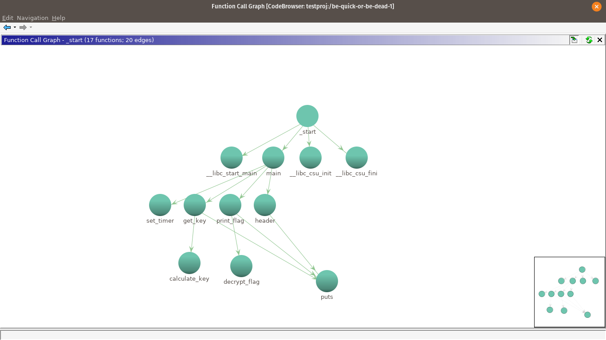
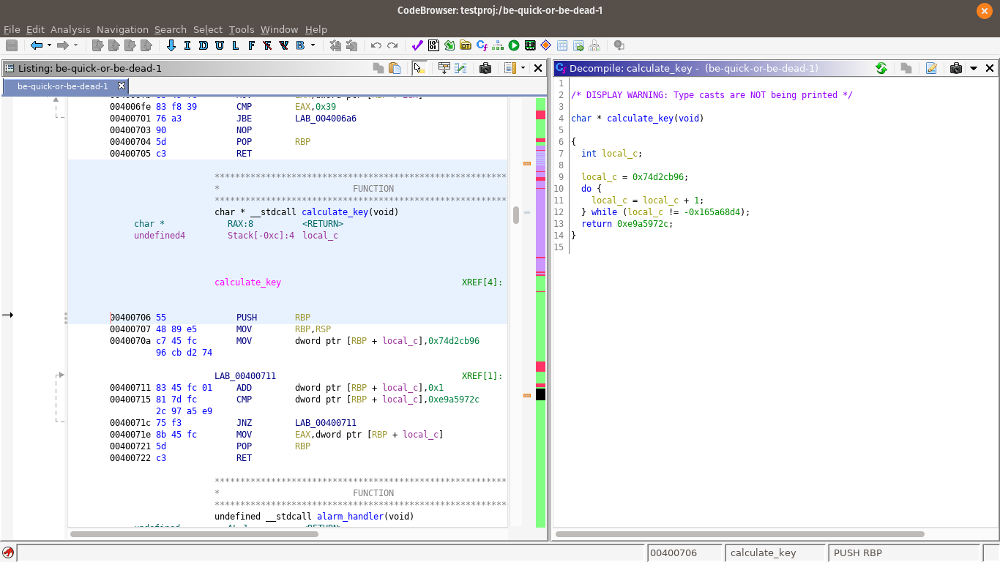
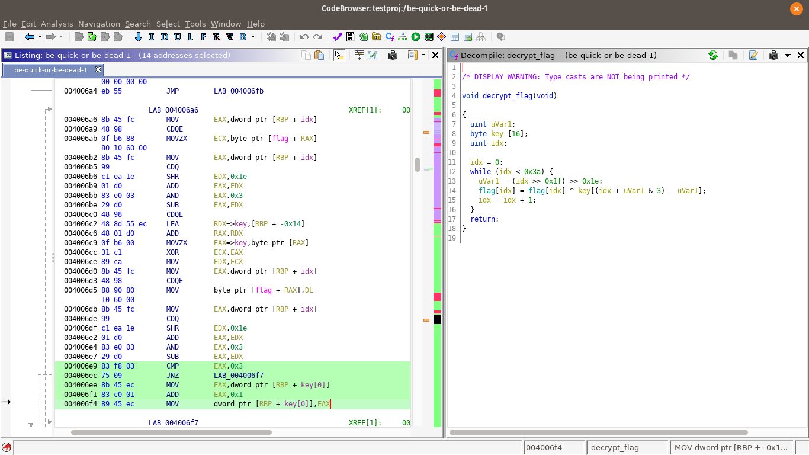
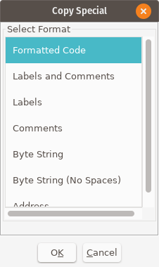

# picoctf reversing challenges

## be quick or be dead
Easy Solution:
+ used Ghidra for static and gdb + GEF for dynamic inspection
+ alarm function could be patched out, to not interfere with the program
+ GDB with GEF seemed to ignore the signal terminating the execution of the binary resulting in pseudo solving the challenge

### Solving it the right way
Due to other challenges being based on this code base, I will illustrate the process for the first challenge in detail. 
When opening ghidra, the first things to look at are entry points of the executable. Before the main function, entry points inserted by the compiler are executed. Some binaries might even avoid using typical entry points like `main` or `WinMain`, for windows executables, as a form of obfuscation.
Still, trying to find main is always worth a shot. In ghidra this can be achieved by selecting the _Listing window_, pressing `g` and searching for `main`.

From the entry point, functions called during execution of the binary can be found.
Since this is a CTF challenge, symbolic information was kept during compilation of the binary. In general, symbolic information, like names for functions, data and variables, are often stripped from a binary. This reduces the size or makes it more difficult to reverse it. But this only means an analyst has to invest more time in reconstructing and naming symbols. It does not make the process unfeasible. Therefor, the information is sometimes kept for CTF challenges, reducing the time required for the analysis.

This binary follows the steps of setting a timer, calculating a key and afterwards decrypting and printing a flag during its execution. The timer is set in such a way, that it interrupts the slow key calculation process and the flag is never printed. So one could either patch out the timer or reverse the decryption algorithm to get the flag.
Removing the timer becomes a non-option for later challenges due to increased complexity (and inefficiency) of the key generation algorithms.



The call graph shows the most essential functions. Especially `get_key` and `print_flag`.

Since the decryption process requires a key, `get_key` is called. This function in turn calls the `calculate_key` function displayed below.



`calculate_key` does some unnecessary computation by increasing a variable until it overflows to a specific negative value and then returns a fixed key.
This fixed key value can be used in the decryption of the flag.

The flag calculation happens in the `decrypt_flag` method during the execution of the `print_flag` function.



As can be seen from the decompiler output, the index is shifted around at first. Afterwards the flag is xor'ed byte-wise with a byte of the key. This byte is determined by adding the shifted variable to the index and calculating bitwise `AND 3` on this sum. This leads to the key index taking values between 0 and 3, which is equal to modulo 4.
Afterwards the index is increased by one and the decryption continues until 0x3a bytes have been decrpyted.

One operation, that is not covered by the decompiler, happens at address `0x004006ec`. Here, a forwards jump is performed, when the preceding condition is not met. See the marked section in the above image (green background).
This condition results from calculating `AND idx, 3`. Every time the 4th byte of the key is used the `CMP` evaluates to true and the following instructions are executed. 
To be more precise, every time the index equals 3, indicating the 4th byte of the key being used (starting from zero), the comparison sets the zero flag. This leads to the following `JNZ` (jump if not zero) not being executed and the evaluation of the following instructions:
```
        004006ee 8b 45 ec        MOV        EAX,dword ptr [RBP + key[0]]
        004006f1 83 c0 01        ADD        EAX,0x1
        004006f4 89 45 ec        MOV        dword ptr [RBP + key[0]],EAX
```
Here, the first byte of the key is loaded into `EAX`, increased by one and then written to the position of the first byte of the key in memory. Due to the executable being in little endian, this is equal to the lowest byte of the key.

So overall, every time the 4th byte is used in decryption, the first byte is incremented by one.

The last puzzle piece consists of retrieving the encrypted flag from the binary. To do so, one has to simply double click the `flag` symbol, which is used in the `decrypt_flag` function. Ghidra then jumps to the data section containing the `flag` string (rodata section). The flag can be copy pasted by multi-selecting the bytes at position `0x00601080`, right clicking the selection and choosing `copy special`. The following dialogue window appears and by selecting `Byte String` the hex values can be copied into an editor of choice. By using the common replace feature `ctrl+h`, they can be comma separated and further used in a python script.



The solution can then be constructed by rewriting the algorithm in a language of your choice.
I developed my solutions in the corresponding python files `be_quick... .py`.

### summary
+ all in all 2 critical functions can be identified:
  + `generate_key` and `decrypt_flag`
  + `generate_key` does calculations and afterwards returns a fixed / pre defined key
  + `decrypt_flag` calculates stuff by shifting the index variable
  + the first shift simply clears out the register - since idx is always positive, cdq, which fills edx with the sign of eax, clears edx zeroing out the register
  + all other instructions can be taken from ghidra decompiler
  + in essence each byte of the flag is xor'ed with the corresponding (idx) byte of the key, modulo/ wrap around is used to limit the evaluation to the first 4 bytes of the key; this gets more important in later challenges, which use keys longer than 4 bytes, where, due to the endianness of the binary, only the last (lowest) 4 bytes are used
  + each time the first byte of the key is used again, it is incremented by 1 - this is a detail the ghidra decompiler missed, but can be taken from the assembly instructions
  + you are most likely confronted by the incompleteness of the decompilation output, when being presented with a visibly wrong output flag 
  + since the flags start with `picoCTF{...` and after every 4 bytes an increment happens, the `C` in CTF will be mangled
  
## asm2 loop
 + from the asm file it can be seen, that both variables are copied into the local variable space
 + afterwards one variable functions as an index of sorts, the other is incremented by one for every loop iteration
 + the index is incremented by 0xa9 (169 dec) for each iteration, until it reaches 0x3923 (14627 dec)
 + the incremented variable is returned at the end
    ```
    (0x3923 - 0x8) // 0xa9 = 86
    hex(86+33)
    '0x77' + 0x1  # for the first iteration
    ```

## quackme
 + really straight forward challenge, see solv_quackme.py
 + user has to input data
 + data is xor'd with "sekrutBuffer" char by char and compared to the greetingMessage
 + after 0x19 matching chars, 25 in dec, the comparison ends
 + after every input char is compared, the comparison also ends
 + comparison is as follows:
    ```
    greetMsg[idx] == inputdata[idx] XOR sekrutBuffer[idx]
    ```
 + because XOR is self inverse, we can rewrite the problem to
    ```
    greetMsg[idx] XOR sekrutBuffer[idx] == inputdata[idx] 
    ```
 + due to a lack of other information, the input data had to be the solution (also the name indicates a crack me, so generating a valid input key is the target of the challenge)
 + right input is constructed from the above algorithm
 
## crypto challenge: here comes johnny
 + used johhny (GUI for johntheripper)
 + password is contained in rockyou.txt
 + pw could even be guessed / common password

## be-quick-or-be-dead-2
 + challenge is similar to the first one
 + in fact the decrypt flag algorithm is the same as in the first challenge
 + 2nd challenge uses a different flag and key 
 + the key is calculated as fib(0x42b), with an inefficient, recursive algo
 + by calculating the key and, similarly to the first challenge, using the last 4 byte
  of the key to decrypt the flag, the solution is build
 + make sure to use the right flag string, I had some issues and tried to manully construct the key
 from xor'ing the flag with "pico" and calculating the decrpytion key (known plaintext attack) but later noticed,
 that I still used the cypher from the first challenge

## be quick or be dead-3
 + key gen got more complicated and is reminiscient of a fibonacci using 5 instead of 2 predecessors
 + problem with previous fibonacci implementation and this algorithm lies in unnecessary computations
 due to branching of the recursive calls
 + this results in plenty of unnecessary computations
 + to do this more efficiently, pre calculate everything in an incremental fashion and store results -> dynamic programming
 + see be_quick3-solv.py for implementation

## quackme_up
 + [rol and ror](https://www.aldeid.com/wiki/Category:Encryption/rol-ror)
 + these instructions perform shifts and mirror rotate all bits of a register
 
